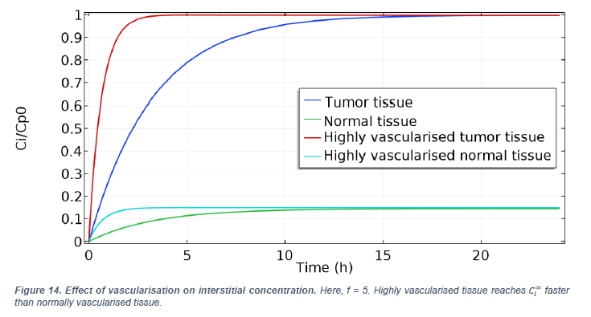

# Effect of local changes in vascularisation on cancer drug delivery

## Abstract

Cancer is the second cause of death worldwide. Most of cancers are caused by solid tumours. A mathematical model of a homogeneous, alymphatic solid tumour shows that interstitial fluid pressure is higher near its core. The consequences of this elevated pressure are twofold. First, high pressure causes a radially outward convective flux. Then, higher pressure limits fluid extravasation from the blood vessels. Consequently, drug therapies struggle to tackle the entire tumour since drugs tend to stay localised at the tumour periphery. The model was then extended to consider local variations of vascularisation which can occur as blood vessels are invaded by the tumour. In the case of a continuous perfusion, we show that higher vascularisation increases the drug uptake rate without any significant impact on the final concentration value in the tissue. Moreover, our study shows local changes in vascularisation only have a local effect and do not affect drug delivery in surrounding tissue. This is due to the limited impact on the pressure profile and the small drug diffusion coefficient. For a decaying plasma concentration, increase in vascularisation leads to a higher maximum interstitial concentration value but it is maintained for shorter periods. Interestingly, the average concentration over time after 24h was unchanged when vascularisation was increased locally. This means drugs requiring a threshold interstitial concentration to be effective work best in highly vascularised areas, whilst drugs requiring a more stable drug uptake work best for typical tumour vascularisation given in the baseline case. In addition, we also show that decreasing vascularisation significantly reduces both the average interstitial concentration and the maximum concentration. This suggest anti-angiogenesis drugs have a compromise to find: they must effectively reduce vascularisation to prevent the tumour from growing, whilst maintaining sufficient vascularisation to allow for other drugs to work.

## Key figures
### Baseline case - Baxter and Jane study

### Model extension - effect of vascularisation change
  

## Contact
To get access to the full paper, contact [Thomas Galeon](https://github.com/TheGaga).
